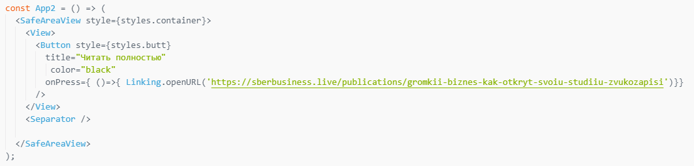

# Стили в React Native

## Цель работы

### Получить навыки работы со стилями в React Native.

## Задания для выполнения

- Используя стартовый шаблон https://snack.expo.io/ оформите контент

## Контрольные вопросы
- Приведите аналоги тегов html в React Native:
:white_check_mark: div - view разделяет экран 
:white_check_mark: p - text - разделяет на параграфы 
:white_check_mark: img - image - вставляет изображения 
:white_check_mark: button - в "react native" аналогично

# Report

## Result

