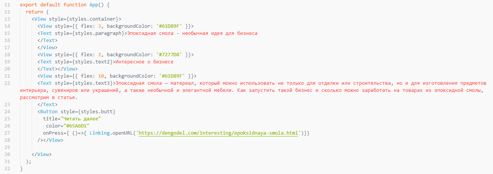

# Гибкие элементы в React Native

## Цель работы

### Получить навыки работы с адаптивными объектами в React Native.

## Задания для выполнения

- Используя официальную документацию https://reactnative.dev/docs/height-and-width

## Контрольные вопросы
- Как в React Native сделать объекты фиксированной ширины и длинны?

:white_check_mark: С помощью атрибутов height и width, если нужно учитывать пропорции, то используется flex

## Дополнительные задания:
:white_check_mark: Добавьте кнопку «Читать далее»

## Result

# Project

- https://snack.expo.dev/@xgrekx/cd2_2
