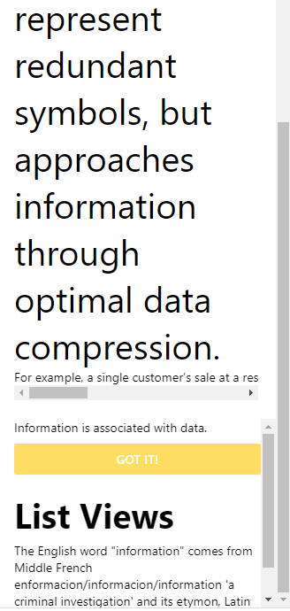
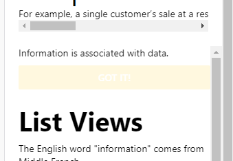
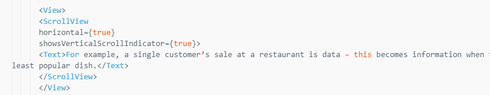

# Основные компоненты React Native

## Цель работы

- Получить навыки работы с основными компонентами в React Native.

## Задания для выполнения

-	Используя официальную документацию https://reactnative.dev/docs/components-and-apis#user-interface создайте экран с тремя и более основными компонентами

## Контрольные вопросы

- Какой компонент является базовым?

:white_check_mark: горизонтальный ScrollView

## Result

- В приложении используется несколько ScrollView - горизонтальный и вертикальный, а также Button, Alert, View, Stylesheet, Text

# Project

https://snack.expo.dev/@xgrekx/cd2_3
