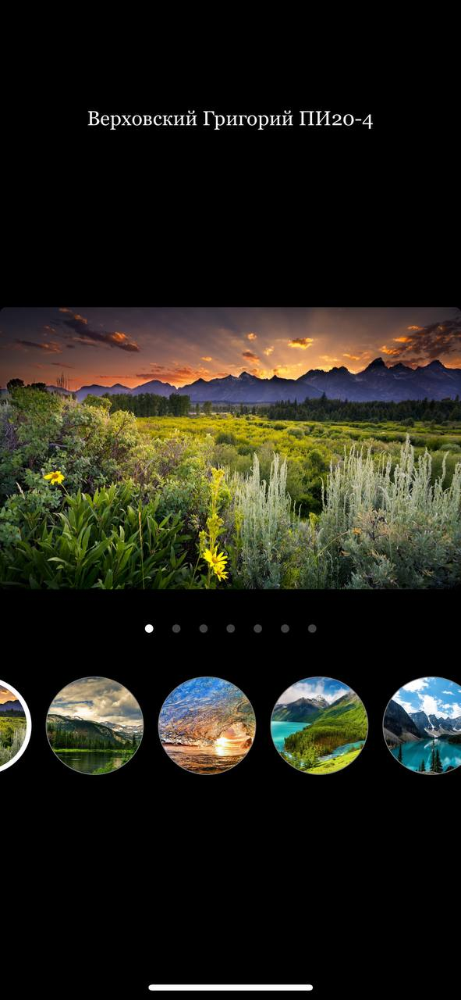
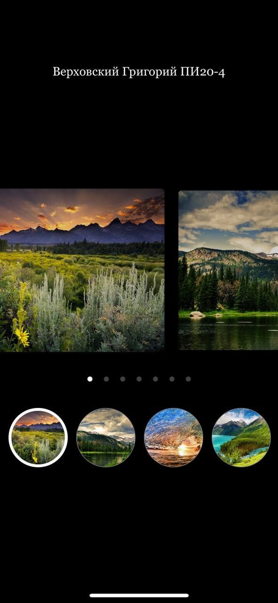

# Анимация в React Native

## Цель работы

- В этой работе мы рассмотрим основные принципы анимации, которые можно реализовать с помощью React Native.

## Задания для выполнения

-	Используя официальную документацию https://reactnative.dev/docs/animated ознакомьтесь с синтаксисом 
-	Ознакомьтесь с основными принципами анимации: https://infogra.ru/ui/12-printsipov-primeneniya-animatsii-v-polzovatelskih-interfejsah 
-	Создайте анимацию для слайдера с различными картиками, добавьте другие компоненты на экран
-	Добавьте основные компоненты на экраны и создайте книгу контактов, галерею или любое другое простое приложение

## Что такое параллакс-эффект?

:white_check_mark: Это смещение близкого объекта относительно далекого при изменении угла зрения. Благодаря этому эффекту мы видим предметы в объеме, воспринимаем глубину и понимаем, что находится ближе, а что дальше.

## Result

# Project

https://snack.expo.dev/@xgrekx/cd2_5
