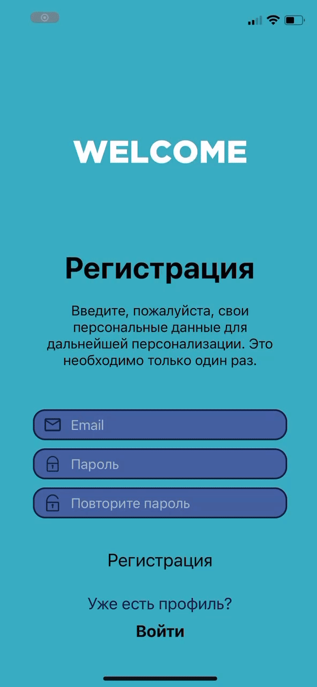

# Форма регистрации

## Задания для выполнения

- Создайте форму регистрации с экраном альтернативной авторизации в React Native.

- Добавьте всплывающее сообщение для кнопок: «Регистрация/Авторизация прошла успешна».

## Контрольные вопросы

- Какие основные свойства для выравнивания объектов на экране существуют?

:white_check_mark: margintop, bottom

# Result

# Project

https://snack.expo.dev/@xgrekx/cd2_6
