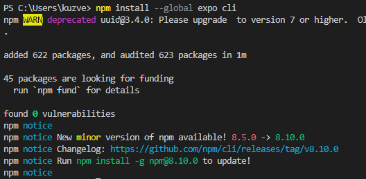
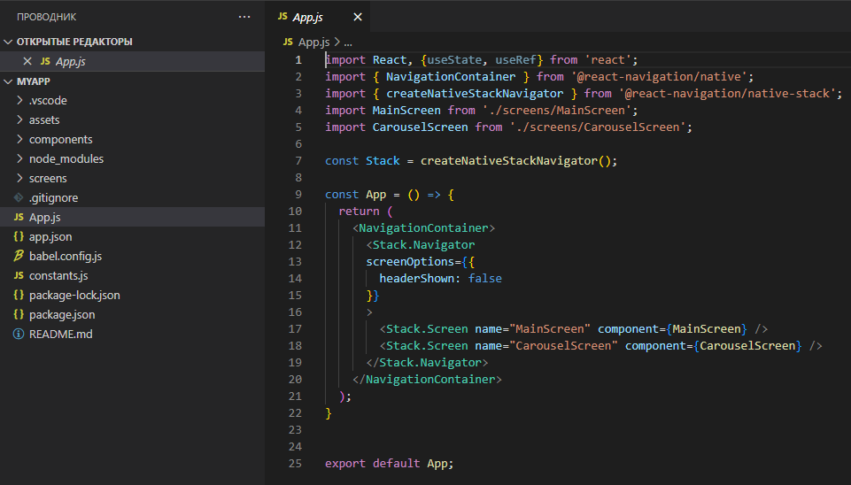

# Установка среды разработки

## Задания для выполнения

- Следуя руководству https://www.reactnative.express/environment/quick_start установите среду разработки React Native.

- Добавьте функциональные элементы на экран, обновите приложение.

- Поделитесь ссылкой на проект в Expo.

# Result

# Project 

https://snack.expo.dev/@xgrekx/course-ready
