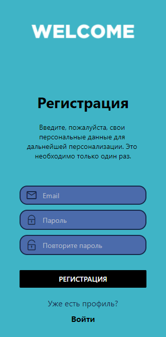
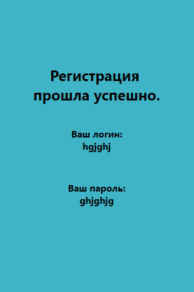

# Передача данных с формы

## Задания для выполнения

- Изучите реализованный пример: https://snack.expo.dev/49WY2dQMS.

- Ознакомьтесь с описанием компонента ImageBackground https://docs.expo.dev/ui-programming/image-background/

- Используя реализованную навигацию для велком-скрина с регистрацией (лабораторная 7), создайте экран с приветствием, данные на который будут поступать с соседнего экрана.

# Result

# Project 

https://snack.expo.dev/@xgrekx/cd2_8
