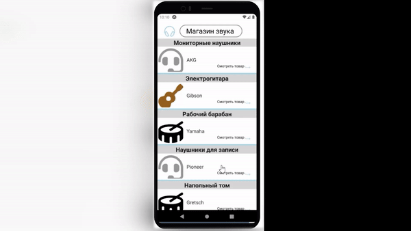

# Компоненты для Android и IOS

## Цель работы

- В этой работе мы познакомимся со специфичными компонентами для каждой из платформ.

## Задания для выполнения

- Используйте официальную документацию https://reactnative.dev/docs/components-and-apis#android-components-and-apis ознакомьтесь с основными компонентами в React Native для каждой из платформ.

- Ознакомьтесь с гайдами UX/UI для каждой из платформ: https://developer.apple.com/design/human-interface-guidelines/
https://material.io/

- Выберите одну из платформ и реализуйте типовой экран, включающий основные компоненты для нее. Например с помощью supportedURL реализовать

## Result

# Project

https://snack.expo.dev/@xgrekx/cd2_9
